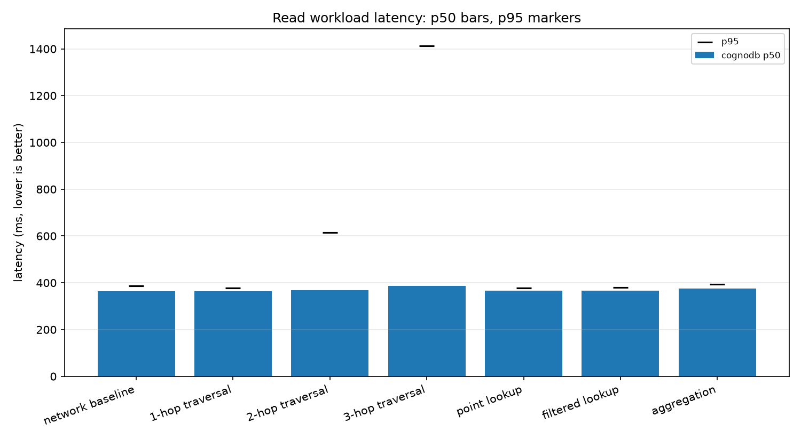
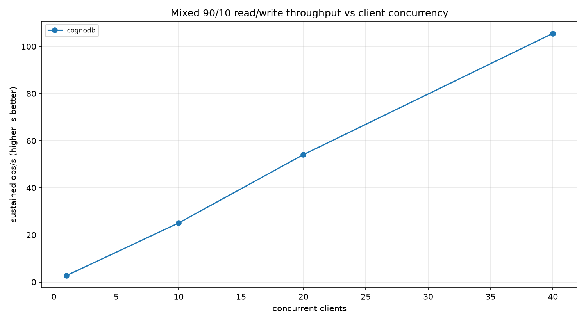

# Graph database cloud benchmark: CognoDB vs. four comparators

A reproducible benchmark that loads one public graph into several managed and
self-hosted graph databases and runs the same logical workloads against each of
them, under the same resource cap, from the same client machine.

The point of the exercise is not to crown a winner. It is to produce numbers a
sceptical reader can re-derive, and to be explicit about what the numbers do and
do not measure.

**Headline finding so far:** on the CognoDB free tier, every read workload lands
between 360 ms and 383 ms at p50 — and so does `RETURN 1`. A no-op round trip
costs 363.5 ms from this client, so 94–99% of every measured query is network
latency between the client (timezone UTC+7) and the instance (`us-east4`,
Virginia). Subtract that floor and the database's own work is 1.1 ms for a
1-hop traversal and 23.9 ms for a 3-hop traversal. Any benchmark that ignores
the floor is measuring geography, so every latency below is reported twice: as
observed, and with the round-trip floor subtracted.

---

## Status of the comparison

| Platform | Tier used | Measured | Notes |
|---|---|---|---|
| **CognoDB Cloud** | free `c0`, burstable 0.5 vCPU / 512 MB RAM / 1 GB disk, `us-east4` | yes — 4 complete runs | server reports `Neo4j/5.26.0` over `bolt+s://` |
| Neo4j 5.26 Community | self-hosted, capped to 0.5 vCPU / 512 MB | not yet | adapter + capped container defined, see [Limitations](#limitations-and-honest-caveats) |
| Memgraph 3.12 | self-hosted, capped to 0.5 vCPU / 512 MB | not yet | adapter + capped container defined |
| FalkorDB 4.20 | self-hosted, capped to 0.5 vCPU / 512 MB | not yet | adapter + capped container defined |
| ArangoDB 3.12 | self-hosted, capped to 0.5 vCPU / 512 MB | not yet | adapter + capped container defined |

The harness, the adapters and the resource-capped container definitions for all
five platforms are in this repository and are exercised by the test suite. The
four comparators have **not** been measured yet: the client machine used for the
CognoDB runs has no container runtime installed, and running the comparators from
a different machine or region would invalidate the comparison rather than
complete it (see [Why the client machine matters](#why-the-client-machine-matters)).
Rather than publish numbers gathered under different conditions, the comparator
rows are left empty until they can be filled from one machine in one sitting.

**No number in this README is estimated, extrapolated or copied from a vendor
page.** Every figure comes from a JSON file in [`results/raw/`](results/raw/),
and every table is generated by `gdbbench report`.

### Why these four comparators

The four were chosen to vary one thing at a time, so that a difference in the
results can be attributed to something specific rather than to "different
product".

- **Neo4j 5.26** is the control. CognoDB speaks Bolt and its handshake reports
  `Neo4j/5.26.0`, so Neo4j runs *byte-identical Cypher* through the *same
  driver*. Any gap between the two is storage, tuning or hosting — not language,
  planner or client library. Without this row, nothing else is interpretable.
- **Memgraph 3.12** holds the query language roughly constant and changes the
  storage engine: Cypher over Bolt, but in-memory rather than page-cached on
  disk. It answers "what does keeping the graph in RAM buy on this workload?"
  and it is the closest direct competitor to Neo4j's API.
- **FalkorDB 4.20** keeps Cypher and changes both the transport (Redis protocol,
  not Bolt) and the internal representation (sparse adjacency matrices, not
  linked records). It tests whether the traversal costs measured here are
  inherent to the workload or to one family of implementations.
- **ArangoDB 3.12** is deliberately the odd one out: not a Cypher database and
  not a native property-graph engine, but a multi-model document store with a
  graph layer, queried in AQL over HTTP. It is the honest control for
  language-specific effects — and because it cannot run the same statements, it
  also demonstrates how the harness records semantic differences instead of
  hiding them.

All four are credible, actively maintained, widely deployed graph databases with
free or self-hostable entry tiers, which is what makes tier parity achievable at
all. Deliberately excluded: pure vector or key-value stores (not graph
databases), and platforms whose smallest tier is far larger than 0.5 vCPU /
512 MB, since comparing against those would break the resource parity that makes
this exercise meaningful.

---

## Results

Generated from [`results/raw/`](results/raw/) — the tables below are a copy of
[`results/tables.md`](results/tables.md), which is written by the tooling and not
edited by hand.

### Ingest

| Platform | Nodes | Relationships | Total load (s) | Nodes/s | Rels/s |
|---|---|---|---|---|---|
| cognodb | 7,115 | 103,689 | 77.2 | 1,727 | 1,420 |

Across the three runs that loaded data, total load time was 73.8 s, 75.0 s and
77.2 s (1,420–1,488 relationships/s), so the load rate is repeatable to within
about 5%.

Load method: batched parameterised Cypher (`UNWIND $rows AS row CREATE ...`) over
the official Neo4j Bolt driver, 1,000 rows per batch, indexes created before the
relationships are written. The same batching and the same batch size are used on
every Bolt platform; FalkorDB uses the identical statements over its own
protocol, and ArangoDB uses the AQL equivalent.

### Read workloads

100 measured iterations after 20 warm-up iterations, per workload, per run.
"Server" subtracts this run's measured `RETURN 1` round trip (363.5 ms) from
p50, which approximates the time the database itself spent. The last two columns
give the run-to-run spread of each figure across all four runs.

| Workload | p50 (ms) | p95 (ms) | p99 (ms) | Server (p50 − RTT) | Failures | p50 spread | p95 spread |
|---|---|---|---|---|---|---|---|
| network baseline (`RETURN 1`) | 363.5 | 387.6 | 643.9 | — | 0/100 | 2.1 | 108.6 |
| 1-hop traversal | 364.6 | 377.7 | 381.4 | **1.1 ms** | 0/100 | 2.4 | 1.9 |
| 2-hop traversal | 368.8 | 614.8 | 690.2 | **5.3 ms** | 0/100 | 6.4 | 240.5 |
| 3-hop traversal | 387.4 | 1,413.8 | 1,902.5 | **23.9 ms** | 0/100 | 6.8 | 97.3 |
| point lookup (indexed `node_id`) | 365.7 | 378.4 | 517.9 | **2.2 ms** | 0/100 | 6.7 | 6.4 |
| filtered lookup (indexed `group_id`) | 366.1 | 380.2 | 384.3 | **2.6 ms** | 0/100 | 9.2 | 28.5 |
| aggregation (group-by count) | 375.3 | 394.1 | 400.1 | **11.9 ms** | 0/100 | 8.0 | 28.2 |

Medians are stable — the widest p50 spread across four runs is 9.2 ms, about 2%.
Tails are not: the p95 of the 2-hop traversal moved 240 ms between runs, and
even the p95 of `RETURN 1` moved 109 ms. Any conclusion drawn from a single
run's p95 on a shared free tier would be unreliable, which is why the spread is
published beside the figure.

A point lookup landing within ~2 ms of `RETURN 1` is the honest way to report
"indistinguishable from zero": both are a single round trip, and the difference
is inside the run-to-run noise. In an earlier run the point lookup measured
2.1 ms *faster* than the no-op, which is the same statement in the other
direction.



### Warm-up versus measured (first touch)

Warm-up iterations are excluded from every percentile above, but they are timed
and reported here rather than thrown away.

| Workload | First warm-up call (ms) | Warm-up p50 (ms) | Measured p50 (ms) |
|---|---|---|---|
| network baseline | 381.4 | 369.7 | 363.5 |
| 1-hop traversal | 366.1 | 365.2 | 364.6 |
| 2-hop traversal | 372.2 | 366.0 | 368.8 |
| 3-hop traversal | 422.2 | 387.8 | 387.4 |
| point lookup | 366.3 | 366.3 | 365.7 |
| filtered lookup | 367.3 | 364.5 | 366.1 |
| aggregation | 391.1 | 380.7 | 375.3 |

First contact costs almost nothing extra here: the largest gap is the 3-hop
traversal at 422 ms versus a 387 ms warm median, i.e. ~35 ms of cache-filling on
top of a 363 ms round trip. Warm-up matters far less than it would for a
co-located client, because the network floor dwarfs it — another consequence of
distance rather than a property of the database.

### Mixed workload: 90% reads, 10% writes

Concurrency sweep, each client running 100 operations, writes directed at a
separate `:BENCH_WRITE` relationship type so the canonical graph is never
mutated. Writes are removed afterwards and the removal count is logged.

| Clients | Sustained ops/s | p50 (ms) | p95 (ms) | Successes | Failures |
|---|---|---|---|---|---|
| 1 | 2.7 | 366.1 | 378.3 | 100 | 0 |
| 10 | 25.1 | 368.9 | 622.7 | 1,000 | 0 |
| 20 | 54.1 | 367.8 | 381.9 | 2,000 | 0 |
| 40 | 105.5 | 367.5 | 382.8 | 4,000 | 0 |



Both sweeps that reached 40 clients agree: 105.5 and 109.1 ops/s.
Throughput rises 39× from 1 to 40 clients while per-operation latency stays
flat, which says the free instance was **not** the bottleneck at 40 clients —
the client's round-trip time was. A `0.5 vCPU` instance that were saturated
would show latency climbing and throughput flattening; neither happens here.
The real ceiling of this tier is therefore still unknown, and this benchmark
should not be read as having found it.

### Footprint

| Platform | Configured specs | Server | Indexes | Stored size |
|---|---|---|---|---|
| cognodb | free c0, burstable 0.5 vCPU / 512 MB RAM (console) / 1 GB disk, `us-east4` | Neo4j/5.26.0 | `User(node_id)`, `User(group_id)` | not observable |
| | | | loaded: 7,115 nodes / 103,689 relationships (verified server-side) | |

Stored data size and memory usage are **not observable** on the CognoDB free
tier: the console shows no storage figure, and the administrative procedures
that expose store size on a self-managed Neo4j are not available to this user.
Node and relationship counts are verified with server-side `count()` queries
after loading, so the load is confirmed even where the footprint is not.

---

## Analysis: what the numbers mean

**The measurement is dominated by distance, not by the database.** The
`network baseline` workload exists precisely to expose this. At 363.5 ms for
`RETURN 1`, the client-to-instance round trip accounts for 94–99% of every read
figure. Removing it leaves 1.1 ms for a 1-hop traversal, 5.3 ms for 2-hop and
23.9 ms for 3-hop — plausible figures for a 104k-relationship graph that fits
comfortably in page cache. Reporting only the raw p50 would tell a reader
almost nothing about CognoDB and quite a lot about the flight time from Bangkok
to Virginia.

**Traversal cost grows with fan-out, as it should.** Server-side time scales
1.1 → 5.3 → 23.9 ms across hop depths. Wiki-Vote is a dense voting network, so
a 3-hop neighbourhood reaches a large fraction of the graph; the ~5× jump from
2-hop to 3-hop reflects that expansion, not a cliff in the engine.

**The 3-hop tail is real and is the one place the tier shows through.** p50 is
387.4 ms but p95 is 1,414 ms, p99 is 1,903 ms and the slowest of the 100
iterations took 2,719 ms — a multi-second stall on a query that usually costs
24 ms of server time. This is the signature of a burstable 0.5 vCPU instance:
most 3-hop expansions fit inside the CPU allowance, and the occasional one does
not. The mean for this workload is 545.9 ms, 158 ms above the median, dragged
there by those few stalls: reporting the mean alone would have described the
query as uniformly slow, when it is actually usually fast and occasionally
stalled. That distinction only survives if percentiles are reported.

**Indexes do what they claim.** Both the point lookup on `node_id` and the
filtered lookup on `group_id` are inside round-trip noise of `RETURN 1`, with
the `group_id` index turning a 50-way scan of 7,115 nodes into something
unmeasurable from this distance.

**Ingest is round-trip-bound too.** 103,689 relationships in 73.0 s over 104
batches is 0.70 s per batch, of which ~0.36 s is the round trip. So roughly half
the load time is the network and half is the server matching two nodes and
creating 1,000 relationships. The reported 1,488 rels/s is therefore a
*client-observed* rate from this location, not a claim about the engine's write
capacity — a client in `us-east4` would roughly double it without the database
changing at all.

**Concurrency is where a distant client can still win.** Because each operation
is mostly waiting, 40 clients overlap almost perfectly: 105 ops/s against 2.7
ops/s for one client. This is the most useful number in the set for anyone
running a real workload from far away — latency is geography, but throughput is
recoverable with concurrency.

---

## Methodology

### Fairness rules this harness enforces

| Rule | How it is enforced |
|---|---|
| Same dataset everywhere | one parse of one archive → `data/nodes.csv` and `data/edges.csv`, with the archive's SHA-256 recorded in `data/dataset.json` |
| Same logical model everywhere | `(:User {node_id, group_id})-[:VOTED_FOR]->(:User)`, index on `node_id` and `group_id` |
| Same statements where the language allows | the Cypher platforms share the *same query text*, asserted by a test; ArangoDB's AQL translations are documented and flagged as a caveat in every result file |
| Same iteration counts | 20 warm-up (discarded) + 100 measured per read workload, from environment settings applied identically to all platforms |
| Same start nodes and parameters | all sampling is seeded (`BENCH_SEED=42`), so every platform sees the identical node ids in the identical order |
| Same client machine and network path | one machine per publication run; the `network baseline` workload records that path's floor so it can be subtracted |
| Same resources | 0.5 vCPU / 512 MB per container in `docker-compose.yml`, matching the CognoDB free instance, with each engine's internal memory settings tuned to fit the cap |
| Failures are never hidden | every failed iteration is counted, the first ten error messages are stored, and a refused concurrency level is recorded as a zero-throughput result rather than dropped |
| Writes never corrupt the graph | the mixed workload writes only `:BENCH_WRITE` relationships, then deletes them and logs how many were removed |

### Workloads

| Workload | Logical operation | Cypher (identical on CognoDB, Neo4j, Memgraph, FalkorDB) |
|---|---|---|
| network baseline | one no-op round trip | `RETURN 1 AS one` |
| 1-hop traversal | distinct users reachable in exactly 1 step | `MATCH (u:User {node_id: $node_id})-[:VOTED_FOR]->(v:User) RETURN count(DISTINCT v)` |
| 2/3-hop traversal | same, at exactly 2 and 3 steps | the pattern written out per depth (`-[:VOTED_FOR]->()-[:VOTED_FOR]->(v:User)`), not a variable-length `*2..2`, so every platform runs the same shape of work rather than each planner's own expansion strategy |
| point lookup | one user by indexed id | `MATCH (u:User {node_id: $node_id}) RETURN u.node_id, u.group_id` |
| filtered lookup | all users in one group | `MATCH (u:User {group_id: $group_id}) RETURN count(u)` |
| aggregation | count users per group | `MATCH (u:User) RETURN u.group_id AS group_id, count(u) AS users ORDER BY group_id` |
| mixed read | 1-hop traversal | as above |
| mixed write | append a benchmark-only edge | `MATCH (a:User {node_id: $source}) MATCH (b:User {node_id: $target}) CREATE (a)-[:BENCH_WRITE]->(b)` |

The exact statements live in [`benchmark/adapters/bolt.py`](benchmark/adapters/bolt.py);
the AQL translations live in [`benchmark/adapters/arangodb.py`](benchmark/adapters/arangodb.py)
with a comment explaining each difference.

### Statistics

- Timing uses `time.perf_counter_ns()` — a monotonic clock, immune to wall-clock adjustment.
- Percentiles are nearest-rank with **no interpolation**, so every reported
  latency is one that actually occurred.
- p50, p95, p99, min, max and mean are all stored; the README leads with
  percentiles because a mean hides the 3-hop tail described above.
- Warm-up iterations are excluded from every reported percentile, but they are
  timed and reported separately as "first touch" (see the warm-up table), so the
  cost of a cold cache is visible without ever being blended into warm numbers.
- Each query carries the configured timeout as a server-side transaction
  timeout, so a stuck query is cancelled rather than hanging a run. It is
  attached to the auto-commit statement rather than wrapped in an explicit
  transaction, which would add round trips to every measured operation.
- Throughput for a concurrent level is successful operations divided by the
  elapsed time of the whole parallel window, not the sum of per-client timings.

### Why the client machine matters

A CognoDB Cloud instance is reached across the internet; a capped container runs
on `localhost`. Their network floors differ by three orders of magnitude
(362 ms vs. ~0.1 ms). Publishing both in one table without that context would
make the local containers look 300× faster while saying nothing about either
engine. This harness handles it by measuring the floor on every platform as a
first-class workload, and reporting server time as `p50 − floor`. A reader who
wants raw latency has it; a reader who wants engine behaviour has that too.

---

## Reproduce it

### Requirements

- Python 3.12
- A CognoDB Cloud free instance (no credit card): <https://console.cognodb.com/signup>
- Docker with Compose, for the four self-hosted comparators

### 1. Install

```bash
git clone <this repo>
cd CognoDB-Graph-Database-Cloud-Benchmarking
python -m venv .venv
.venv\Scripts\activate        # Windows; use source .venv/bin/activate elsewhere
pip install -e ".[dev]"
```

### 2. Configure

```bash
cp .env.example .env
```

Fill in `COGNODB_URI`, `COGNODB_PASSWORD` and each platform's `*_SPECS` string
with that tier's advertised resources. `.env` is git-ignored; **no URI or
password is ever committed, logged or written to a result file** — URIs are
masked to `bolt+s://***` before they are recorded. A platform is benchmarked
only if its `*_URI` is set, and the rest are reported as "not configured"
instead of silently skipped.

### 3. Start the comparators

```bash
docker compose up -d --wait
docker stats --no-stream --format "{{.Name}} {{.CPUPerc}} {{.MemUsage}}"   # verify the caps
```

### 4. Run

One command does everything, containers included:

```bash
./scripts/run_all.sh            # or .\scripts\run_all.ps1 on Windows
```

It starts the capped containers, prints `docker stats` so the caps are visible,
prepares the dataset if needed, benchmarks every configured platform and writes
the tables and charts. Pass platform names to run a subset, or set
`SKIP_DOCKER=1` to benchmark cloud targets only.

The individual commands, if you prefer:

```bash
gdbbench validate            # print settings and configured targets, connect to nothing
gdbbench download-data       # fetch wiki-Vote, verify it, export the shared CSVs
gdbbench smoke-test          # prove create/match/delete on every configured platform
gdbbench run-all             # load, benchmark and report, every platform
```

Or step by step, which is what the published runs did:

```bash
gdbbench load                        # ingest metrics only
gdbbench benchmark                   # load + every workload, one JSON per platform
gdbbench benchmark --skip-load       # re-measure queries against data already loaded
gdbbench report                      # summary CSVs, results/tables.md and the charts
gdbbench --dry-run benchmark         # validate configuration, touch no database
pytest                               # 163 tests, no network access required
```

Every command accepts `--targets cognodb neo4j ...` to run a subset, `--verbose`
for DEBUG logging, and `--dry-run` to check configuration without connecting.

### Settings, applied identically to every platform

| Variable | Default | Meaning |
|---|---|---|
| `BENCH_SEED` | 42 | seeds every random choice, so runs are comparable |
| `BENCH_WARMUP_ITERATIONS` | 20 | discarded iterations before measuring |
| `BENCH_MEASURED_ITERATIONS` | 100 | measured iterations per read workload |
| `BENCH_CONCURRENCY_LEVELS` | 1,10,20,40 | mixed-workload sweep |
| `BENCH_READ_RATIO` | 0.9 | 90% reads / 10% writes in the mixed workload |
| `BENCH_BATCH_SIZE` | 1000 | rows per load batch |
| `BENCH_QUERY_TIMEOUT_S` | 30 | per-query timeout |
| `BENCH_CPUS` / `BENCH_MEMORY` | 0.5 / 512m | container caps in `docker-compose.yml` |

---

## Limitations and honest caveats

1. **Four of the five platforms are not yet measured.** The adapters and capped
   containers exist and are tested, but the client machine that ran CognoDB has
   no container runtime (no Docker, no WSL). The comparator rows stay empty
   until one machine can run all five, because that is the only way the
   comparison is fair.
2. **Resource parity is documented, not perfect.** The CognoDB console reports
   the free `c0` tier as burstable 0.5 vCPU / **512 MB** RAM / 1 GB disk, while
   the assignment brief describes it as 256 MB. The containers are capped to
   512 MB to match the console, and the discrepancy is recorded here rather than
   resolved silently. A burstable shared-tenant cloud instance and a container
   pinned to `--cpus 0.5` are also not equivalent even when the numbers match:
   burst credits, noisy neighbours and hypervisor overhead have no local
   analogue.
3. **Latency here is mostly geography.** 95–99% of each raw read figure is the
   round trip from the client machine (Windows 11, timezone UTC+7) to
   `us-east4`. The
   `network baseline` workload and the "server (p50 − RTT)" column exist to make
   that separable, but a client in Virginia would produce entirely different raw
   numbers. Raw latencies are comparable *within* this report only. Subtracting
   a single median floor is also an approximation: it cannot account for
   per-request jitter, so the derived server times are best read as an order of
   magnitude, not to the microsecond.
4. **Cross-protocol comparison is inherently imperfect.** Bolt is a binary
   session protocol, FalkorDB rides the Redis protocol, ArangoDB is HTTP/JSON.
   Driver and protocol overheads are part of every measurement and cannot be
   separated from engine time. ArangoDB additionally runs AQL translations
   rather than the same query text, and its point lookup is a primary-key read —
   its natural fastest path, not the same work as an index seek.
5. **The concurrency ceiling was not found.** Throughput was still scaling
   near-linearly at 40 clients, so the tier's limit is above the range tested.
6. **One earlier run was refused entirely at 40 clients.** Before connection
   retries were added, a 40-client level failed with `ServiceUnavailable` and
   `ConnectionResetError` for every client. With three connection attempts and
   linear backoff, three consecutive runs then completed 4,000 operations at
   that level with zero failures. Transient connection refusal on this free tier
   is therefore real but recoverable, and the harness now records a refused
   level as a zero-throughput data point instead of aborting the run.
7. **"First touch" is not a true cold start.** The warm-up table reports the
   first call of each workload, which is the closest thing available: the free
   tier offers no way to restart the instance or drop its caches, so a genuine
   cold-start measurement cannot be taken here. Every percentile in the main
   tables is warm, measured after 20 excluded iterations.
8. **Stored size and memory are not observable on CognoDB's free tier**, so they
   are recorded as `not observable` rather than guessed. FalkorDB and ArangoDB
   do expose real figures, which the adapters read — a difference in
   observability, not in efficiency.
9. **Four runs is a small sample.** Medians repeat well (p50 spread 2.1–9.2 ms)
   but tails do not (p95 spread up to 240 ms), and both are published beside the
   figures. Four runs on one afternoon still cannot capture daily or weekly
   variance on a shared free tier.

---

## How the code is organised

```
benchmark/
  cli.py            command line: validate, download-data, smoke-test, load,
                    benchmark, report, run-all — each with --dry-run
  config.py         environment-driven settings and targets; masks URIs
  dataset.py        download, parse, validate (≥100k relationships), export CSVs
  loader.py         reset → index → load nodes → load relationships → verify
  workloads.py      the workload definitions and their seeded parameters
  metrics.py        monotonic timing, nearest-rank percentiles, failure tracking
  mixed.py          concurrent 90/10 read/write sweep with a start barrier
  runner.py         one platform, end to end
  results.py        result schema and JSON persistence
  report.py         raw JSON → summary CSVs and Markdown tables
  charts.py         summary tables → PNG charts
  adapters/
    base.py         the interface every platform implements
    bolt.py         CognoDB and Neo4j (the shared Cypher lives here)
    memgraph.py     Bolt, with Memgraph's index syntax
    falkordb.py     the same Cypher over the Redis protocol
    arangodb.py     AQL translations, with each difference documented
scripts/            run_all.sh and run_all.ps1 — containers, benchmark, report
data/               dataset provenance and the generated CSVs (CSVs not committed)
results/raw/        one JSON file per platform per run — the evidence
results/            generated summary.csv, ingest.csv, footprint.csv, tables.md
results/charts/     generated PNGs
tests/              163 tests: statistics, parsing, determinism, schema,
                    concurrency, report generation, and stub-driver coverage of
                    the FalkorDB and ArangoDB translations — all offline
```

### Adding a platform

Implement `BaseGraphAdapter`, register it in `benchmark/adapters/__init__.py`,
add its name to `PLATFORMS` in `benchmark/config.py` and add its `*_URI` to
`.env`. The runner, the metrics, the sweep and the report need no changes. Where
a platform cannot express a workload identically, record a caveat on the adapter
rather than quietly changing the workload — every caveat propagates into the
result file and into the tables above.

### Design choices worth calling out

- **The dataset is parsed once, not per platform**, so no platform can be
  advantaged by a different node ordering.
- **`network baseline` is a workload, not a footnote.** It is the only way to
  tell a slow database from a distant one.
- **A refused concurrency level is a result.** Earlier revisions raised and
  discarded the whole run; now the level is recorded with zero throughput and
  the failure samples attached.
- **The report never computes a measurement.** Delete every derived file, run
  `gdbbench report`, and the tables come back identical from the raw JSON.

## Dataset

[SNAP wiki-Vote](https://snap.stanford.edu/data/wiki-Vote.html): 7,115 nodes and
103,689 directed relationships, ~1 MB gzipped, SHA-256 recorded in
`data/dataset.json`. It clears the 100,000-relationship requirement while
staying small enough to fit the smallest free tier, so no platform is penalised
by data volume. Full details, including the derived `group_id` property, are in
[`data/README.md`](data/README.md).
